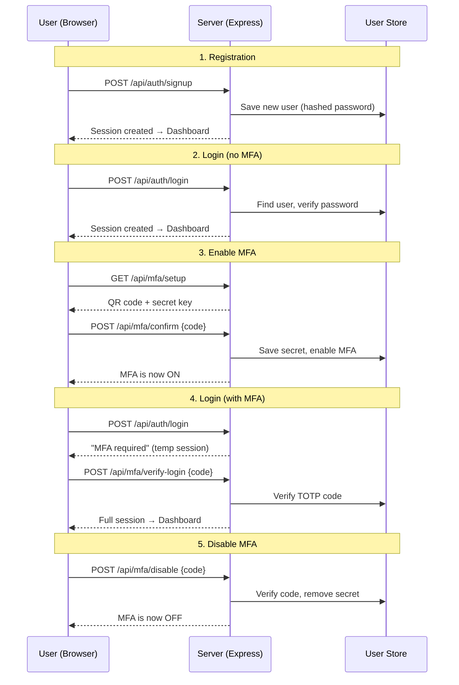

# ShieldAuth - Production-Grade Express.js MFA (TOTP) Demo

ShieldAuth is a secure, production-level Multi-Factor Authentication (MFA) workspace built in Express.js. It implements standard TOTP (Time-Based One-Time Passwords) from scratch using Node's native `crypto` module, avoiding external libraries like `otplib`. 

This codebase is structured following strict **SOLID design principles**, complete with centralized error handling and a premium, responsive glassmorphic user interface.

---

## 🚀 Getting Started

### Prerequisites
Make sure you have [Node.js](https://nodejs.org/) installed (v16.0.0 or higher recommended).

### Installation
Clone the repository and install the dependencies:
```bash
npm install
```

### Environment Configuration
Create a `.env` file in the root directory and populate it with your settings:
```env
PORT=<port_no>
SESSION_SECRET=<your_secret_key>
MFA_ISSUER=<your_issuer_name>
DB_PATH=./data/users
```
* `PORT`: The port on which the Express server will listen.
* `SESSION_SECRET`: The secret key used to sign the session cookie.
* `MFA_ISSUER`: The brand name displayed inside authenticator apps (e.g. Google Authenticator) next to the OTP code.
* `DB_PATH`: File path (without `.json` extension) where user data is persisted. The file is created automatically on first run.

> **Data Persistence:** User registrations, passwords, and MFA settings are stored in a local JSON file (`data/users.json`) using [node-json-db](https://www.npmjs.com/package/node-json-db). Data survives server restarts. A default `admin / password123` user is seeded automatically when the database is first created.

### Running the Application
To run the server in development mode with debugging enabled:
```bash
npm run start:dev
```
Or to run in standard production mode:
```bash
npm start
```
By default, the server runs on **`http://localhost:3001`**. Open this URL in your web browser to access the application.

---

## Complete API Flow (Step-by-Step)

Below is the full lifecycle of the application — from creating an account to enabling, using, and disabling MFA — explained in plain English so that anyone can follow along.

### Visual Overview



---

### Step 1 — Register a New Account

| Detail | Value |
|---|---|
| **API** | `POST /api/auth/signup` |
| **You send** | `{ "username": "...", "password": "..." }` |

**What happens behind the scenes:**
1. The server checks if the username is already taken by searching the user store.
2. Your password is **never stored in plain text**. The server generates a random "salt" (random text) and runs your password through a one-way mathematical function called **scrypt**. The result is a scrambled string that cannot be reversed back into your password.
3. A new user record is created in the store with the scrambled password.
4. A **session cookie** is placed in your browser so the server remembers you are logged in.
5. You are taken straight to the Dashboard.

> **Pre-seeded account:** A demo user `admin` / `password123` is already created when the server starts, so you can skip this step if you prefer.

---

### Step 2 — Log In (MFA Not Yet Enabled)

| Detail | Value |
|---|---|
| **API** | `POST /api/auth/login` |
| **You send** | `{ "username": "admin", "password": "password123" }` |

**What happens behind the scenes:**
1. The server looks up the user by username.
2. It re-runs the same scrypt function on the password you typed and compares the result against the stored scrambled password using a **timing-safe comparison** (a special comparison method that prevents hackers from guessing passwords by measuring response time differences).
3. The server checks: *"Does this user have MFA turned on?"* — **No**, so you are fully logged in immediately.
4. A session cookie is set and you land on the Dashboard.

---

### Step 3 — Enable MFA (The QR Code Flow)

This is a **two-part process**: first the server generates the secret, then you prove you've connected your authenticator app.

#### Part A — Request Setup

| Detail | Value |
|---|---|
| **API** | `GET /api/mfa/setup` |
| **You send** | Nothing (your session cookie identifies you) |

**What happens behind the scenes:**
1. The server generates **20 random bytes** (160 bits) using a cryptographically secure random number generator — think of this as rolling a perfectly fair 256-sided dice 20 times.
2. Those random bytes are converted into a human-readable **Base32 string** (letters A–Z and digits 2–7). This is the "secret key" that only you and the server will ever know.
3. The server formats a special URI: `otpauth://totp/ShieldAuth:admin?secret=XXXXX&issuer=ShieldAuth` — this is a standard format that authenticator apps understand.
4. That URI is turned into a **QR code image** (a base64-encoded PNG).
5. The secret is saved **temporarily in your session** (not yet permanently stored) — it will only be saved permanently after you prove you've scanned it.
6. The QR code image and the text secret are sent back to your browser.

#### Part B — Verify & Activate

| Detail | Value |
|---|---|
| **API** | `POST /api/mfa/confirm` |
| **You send** | `{ "code": "482917" }` (the 6-digit code currently shown in your authenticator app) |

**What happens behind the scenes:**
1. The server retrieves the temporary secret from your session.
2. It calculates what the correct 6-digit code **should be right now** by:
   - Taking the current time and dividing it into 30-second windows.
   - Running the secret + time window through the HMAC-SHA1 hashing algorithm.
   - Extracting 6 digits from the hash result (this is the "dynamic truncation" step).
3. It also calculates the codes for 30 seconds in the past and 30 seconds in the future (to allow for slight clock differences between your phone and the server).
4. If **any** of those three codes match what you typed → success!
6. The server generates 8 single-use **Backup Codes**, hashes them with SHA-256 for secure storage, and returns the plain text codes to your browser.
7. You are prompted to save these backup codes.
8. Future logins will now require a TOTP code or a backup code.

---

### Step 4 — Log In With MFA Enabled (Two-Phase Login)

When MFA is active, logging in becomes a two-step process.

#### Phase 1 — Password Check

| Detail | Value |
|---|---|
| **API** | `POST /api/auth/login` |
| **You send** | `{ "username": "admin", "password": "password123" }` |

**What happens behind the scenes:**
1. Password is verified exactly like Step 2.
2. The server checks: *"Does this user have MFA turned on?"* — **Yes**.
3. Instead of fully logging you in, the server creates a **temporary session** that says: *"This person proved their password, but they still need to enter their TOTP code."*
4. The browser is directed to the **Security Verification** screen.

> At this point you are **not** logged in. You cannot access the dashboard or any protected resource.

#### Phase 2 — TOTP Code Verification

| Detail | Value |
|---|---|
| **API** | `POST /api/mfa/verify-login` |
| **You send** | `{ "code": "739201" }` |

**What happens behind the scenes:**
1. The server reads your temporary session to find out *which* user is trying to complete login.
2. It retrieves that user's stored MFA secret from the database.
3. It performs the same TOTP calculation as in Step 3B (current time window ± 30 seconds drift tolerance).
4. If the code matches → the temporary session is **upgraded** to a full session. You are now completely authenticated.
5. If the code is wrong → you stay on the verification screen and an error message is shown. The temporary session remains active so you can try again.

---

### Step 5 — Disable MFA

| Detail | Value |
|---|---|
| **API** | `POST /api/mfa/disable` |
| **You send** | `{ "code": "158493" }` (current authenticator code) |

**What happens behind the scenes:**
1. For security, you must **prove** you still have access to your authenticator app before MFA can be turned off (this prevents someone who stole your session from disabling your protection).
2. The server verifies the code against your stored secret using the same TOTP algorithm.
3. If valid → the MFA secret is **deleted** from your user record, and MFA is marked as **disabled**.
4. Future logins will only require a username and password.

---

### Step 6 — Log Out

| Detail | Value |
|---|---|
| **API** | `POST /api/auth/logout` |
| **You send** | Nothing (session cookie identifies you) |

**What happens behind the scenes:**
1. The server destroys your session — all stored data (user ID, temporary MFA states) is wiped.
2. The session cookie in your browser is cleared.
3. You are redirected to the login screen.

---

### Step 7 — Check Current Session (Auto-Login)

| Detail | Value |
|---|---|
| **API** | `GET /api/auth/me` |
| **You send** | Nothing (session cookie identifies you) |

**What happens behind the scenes:**
1. Every time you open or refresh the page, the frontend calls this endpoint to check: *"Am I still logged in?"*
2. If a valid session exists, the server returns your profile (username, MFA status) and the dashboard loads automatically.
3. If no valid session exists, you see the login screen.

---

### Step 8 — MFA Recovery via Backup Codes

If you lose access to your authenticator app (e.g., you lose your phone), you can use a Backup Code to log in.

| Detail | Value |
|---|---|
| **API** | `POST /api/mfa/verify-login` |
| **You send** | `{ "code": "A9BCX3V2" }` (an 8-character backup code) |

**What happens behind the scenes:**
1. The server detects that the input is an 8-character alphanumeric string instead of a 6-digit TOTP code.
2. It hashes the input using SHA-256 and checks if this hash exists in your user record's `mfaBackupCodes` array.
3. If it matches, the server **removes** that specific hash from the database so the code can never be used again (single-use).
4. The temporary session is upgraded to a full session and you are logged in.

---

### API Reference (Quick Summary)

| Method | Endpoint | Auth Required | Purpose |
|---|---|---|---|
| `POST` | `/api/auth/signup` | No | Create a new account |
| `POST` | `/api/auth/login` | No | Verify credentials (may trigger MFA challenge) |
| `POST` | `/api/auth/logout` | No | Destroy session and log out |
| `GET` | `/api/auth/me` | Session | Get current user profile |
| `GET` | `/api/mfa/setup` | Session | Generate QR code and temporary secret |
| `POST` | `/api/mfa/confirm` | Session | Verify first code and permanently enable MFA |
| `POST` | `/api/mfa/disable` | Session | Verify code and turn off MFA |
| `POST` | `/api/mfa/verify-login` | Temp Session | Complete the second phase of MFA login |

---

## 🛠️ How MFA TOTP is Implemented & Working

TOTP (Time-Based One-Time Password) is specified in **RFC 6238** (built on top of HOTP, **RFC 4226**). Here is the step-by-step breakdown of how ShieldAuth implements the flow without `otplib`:

### 1. Base32 Encoding/Decoding
TOTP secrets are shared in Base32 (defined in **RFC 4648**). The alphabet contains 32 characters: `A-Z` and `2-7`.
* Located in: [`src/utils/Base32.js`](.../src/utils/Base32.js)
* **Encoding**: Groups bytes into 5-bit chunks, maps each value to the alphabet index, and pads with `=` to align to 8-character blocks.
* **Decoding**: Strips spacing/padding, maps characters to 5-bit values, and aligns them into standard 8-bit bytes (Buffer) for HMAC signing.

### 2. Time-Step Counter
TOTP generates codes based on the current epoch timestamp divided into 30-second steps:
$$\text{Counter} = \lfloor \frac{\text{Current Unix Timestamp in Seconds}}{30} \rfloor$$
This counter is converted into an 8-byte big-endian binary buffer before HMAC hashing.

### 3. HMAC-SHA1 Calculation
The service signs the 8-byte counter buffer using the decoded binary secret via HMAC-SHA1:
$$\text{Hash} = \text{HMAC-SHA1}(\text{Secret Buffer}, \text{Counter Buffer})$$

### 4. Dynamic Truncation
A SHA-1 hash is 20 bytes long. To extract a user-friendly 6-digit code, we dynamically truncate the hash:
1. Read the last nibble (4 bits) of the 20-byte hash. This value (0 to 15) serves as the `offset`.
2. Extract 4 bytes from the hash starting at `offset`.
3. Strip the most significant bit (sign bit) using `& 0x7f` to ensure positive numbers.
4. Apply modulo $1,000,000$ to obtain a 6-digit integer.
5. Pad with leading zeroes if the value is less than 6 digits.

### 5. Clock-Drift Lookup Window
Authenticating devices and servers can experience slight clock shifts. To ensure high usability, the verifier validates the token against the current counter step, the immediate past step ($\text{Counter} - 1$), and the immediate future step ($\text{Counter} + 1$), providing a 30-second leeway.

### 6. Backup Codes Implementation
To provide a secure recovery mechanism if the authenticator device is lost, the system generates single-use Backup Codes during setup.
1. **High-Entropy Generation**: Uses `crypto.randomBytes(8)` mapped to an unambiguous Base32 character set (excluding 0, O, 1, I) to generate 8-character alphanumeric codes.
2. **Secure Storage via Hashing**: Because the generated codes have high cryptographic entropy, they are hashed using the fast `SHA-256` algorithm (`crypto.createHash('sha256')`) before being saved in the database. The plain text code is only shown to the user once.
3. **Single-Use Invalidation**: During login, if the user submits an 8-character code, the server hashes it and compares it to the stored `mfaBackupCodes` array. If a match is found, the hash is immediately removed from the array, permanently invalidating that code.

---

## SOLID Architecture Design

The application structure strictly separates operations to achieve robust modularity:

* **S - Single Responsibility Principle (SRP)**:
  * [`Base32`](file:///Users/umairyetoo/ExpressJSPractice/Express-Generator-Example/myapp/src/utils/Base32.js): Focused only on string base32 translations.
  * [`CryptoUtils`](file:///Users/umairyetoo/ExpressJSPractice/Express-Generator-Example/myapp/src/utils/CryptoUtils.js): Focuses on hashing passwords and timing comparisons.
  * [`TotpService`](file:///Users/umairyetoo/ExpressJSPractice/Express-Generator-Example/myapp/src/services/TotpService.js): Focused only on TOTP calculations and URI creation.
  
* **O - Open/Closed Principle (OCP)**:
  * Concrete repositories extend the abstract [`UserRepository`](file:///Users/umairyetoo/ExpressJSPractice/Express-Generator-Example/myapp/src/repositories/UserRepository.js). If you replace the in-memory engine with PostgreSQL or MongoDB database adapters, you only write a subclass without altering the controllers or auth services.

* **L - Liskov Substitution Principle (LSP)**:
  * [`InMemoryUserRepository`](file:///Users/umairyetoo/ExpressJSPractice/Express-Generator-Example/myapp/src/repositories/InMemoryUserRepository.js) fully honors the contract defined by the base [`UserRepository`](file:///Users/umairyetoo/ExpressJSPractice/Express-Generator-Example/myapp/src/repositories/UserRepository.js), returning expected promise data types and resolving identically.

* **I - Interface Segregation Principle (ISP)**:
  * Repositories and Services expose micro-focused operations. For example, [`QrCodeService`](file:///Users/umairyetoo/ExpressJSPractice/Express-Generator-Example/myapp/src/services/QrCodeService.js) has one job: translating URIs into visual browser images.

* **D - Dependency Inversion Principle (DIP)**:
  * [`AuthService`](file:///Users/umairyetoo/ExpressJSPractice/Express-Generator-Example/myapp/src/services/AuthService.js) does not instantiate its database store or cryptographic engines directly. Instead, they are passed into the constructor via dependency injection:
    ```javascript
    constructor(userRepository, totpService) {
      this.userRepository = userRepository;
      this.totpService = totpService;
    }
    ```
